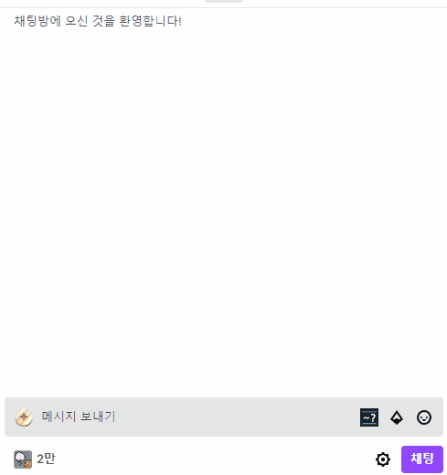

#  Iconttv

Iconttv browser extension source code

구 twitch-icon-selector


## Install

[**Chromium** extension](https://chrome.google.com/webstore/detail/iconttv/jgpcibjnfdgbllfghmaamafafgkadhpf)

[**Firefox** extension](https://addons.mozilla.org/en-US/firefox/addon/%ED%8A%B8%EC%9C%84%EC%B9%98-%EC%BB%A4%EC%8A%A4%ED%85%80-%EC%95%84%EC%9D%B4%EC%BD%98-%EC%84%A0%ED%83%9D%EA%B8%B0/)

## 2.0.4
- 아이콘 선택기에서 `←`, `→`, `↑`, `↓`으로 탐색, `Tab` 혹은 `Enter`로 선택하도록 기능 개선 
- 채팅 입력창 focus가 동작하지 않던 버그 수정 


## 2.0.3
- 성능 및 동작 개선
- 타 플러그인과의 호환성 개선

## 2.0.2

- 태그 닫는 명령어 지원
- 클릭 가능한 팝업 선택기 구현
- 이미지 렌더링 및 태그 변환 수행
- `70px * 70px`사이즈만 렌더링
- 팝업 페이지 구현
- 익스텐션 아이콘 클릭 시 전체 목록 페이지로 이동
- 설정 페이지 없음

- 선택기에서 아이콘 클릭시 `~`가 적용되지 않던 버그 수정 
- 과도한 이벤트로 인한 성능 저하 수정
- 하이퍼링크와 텍스트 사이의 공백이 유지되지 않던 버그 수정


### Limitations

- 파이어폭스 브라우저에서 채팅창 자동 입력 불가
- 파이어폭스에서 사용하려면 익스텐션 아이콘 클릭 후 권한 부여 필요

## Features

- 트위치 생방송, 트위치 다시보기, popout 채팅창, 클립 페이지에서 작동
- 페이지 이동 시에도 끊김 없이 동작
- 버튼 클릭 시 아이콘 목록 보기
- 채팅창에 `~` 입력 시 아이콘 목록 검색 가능
- 아이콘 목록에서 `←`, `→`으로 탐색, `↓`으로 입력. (커서가 입력의 끝이 아닐 때는 남은 문자열을 클립보드에 복사함)
- 아이콘 목록에서 클릭시 입력창에 붙여넣기 또는 클립보드에 복사
- 채팅창에서 아이콘 클릭 시 입력창에 붙여넣기 또는 클립보드에 복사
- 일부 스트리머에 한해서 `[]` 명령어를 지원합니다.

```
[b]굵은글씨
[i]기울어짐
[s]취소선
'''굵은글씨'''
''기울어짐''
~~취소선~~
--취소선--
__밑줄글씨__
[br]줄바꿈
[mq]흘러갈말[/mq]
```



- 전체 아이콘 목록과 개인 통계를 볼 수 있음.


# special thanks to...

Funzinnu

Icons by svgrepo.com

# Development

## Environment Configuration

Configuration with `.env.local` file should be done before running the app.

- About:
  - `FIREFOX_ADDON_ID` Value for Firefox Addon build.

## Contribution

Suggestions and pull requests are welcomed!.

---

This project was bootstrapped with [Chrome Extension CLI](https://github.com/dutiyesh/chrome-extension-cli)
